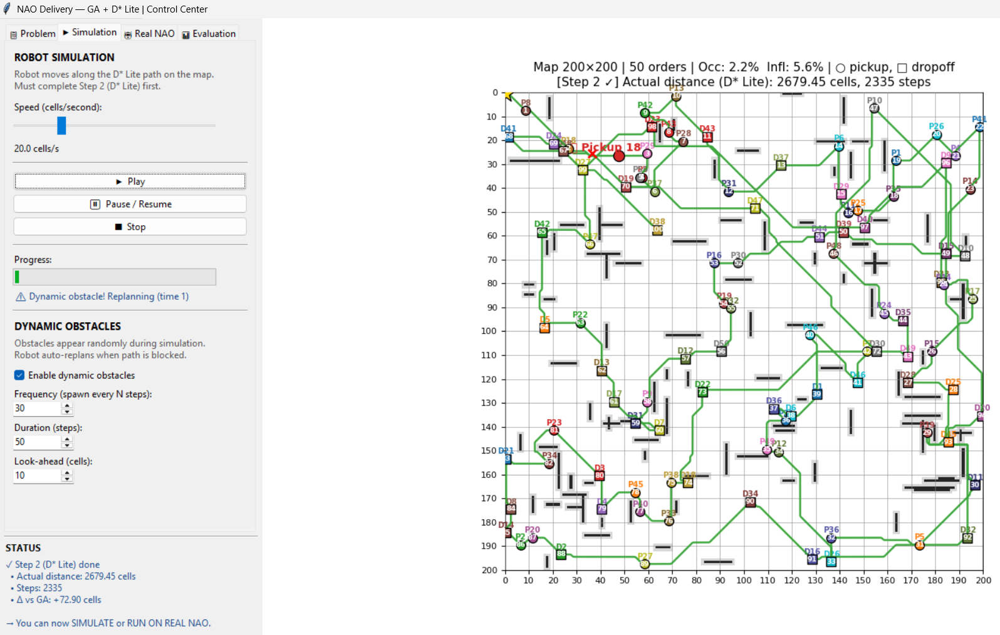
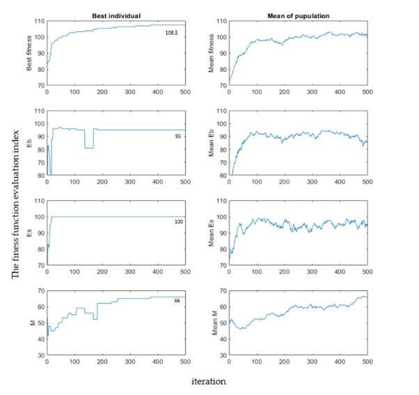
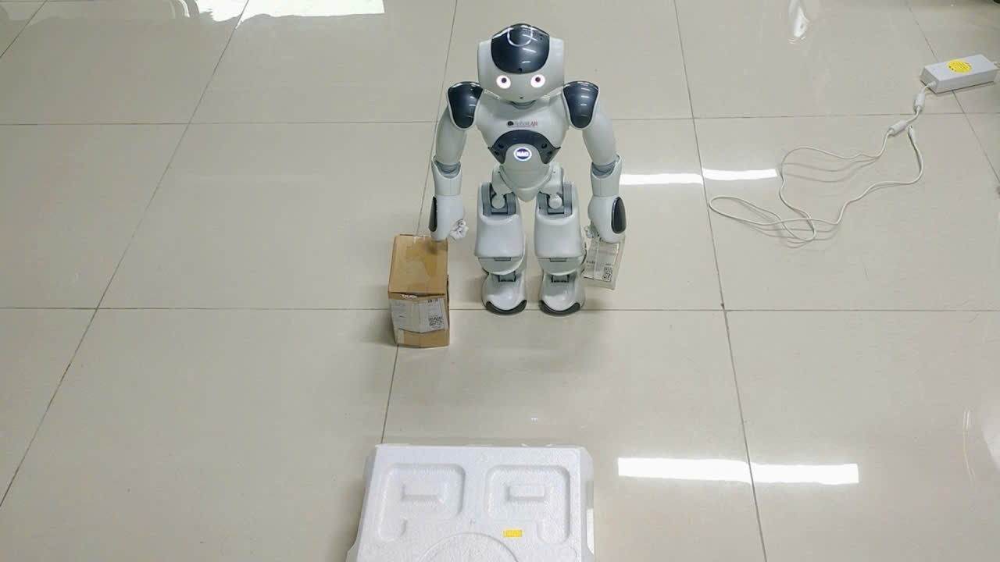
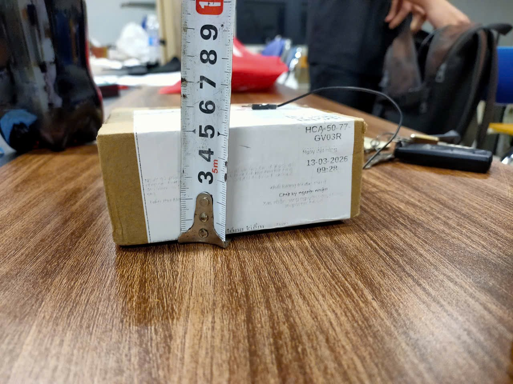
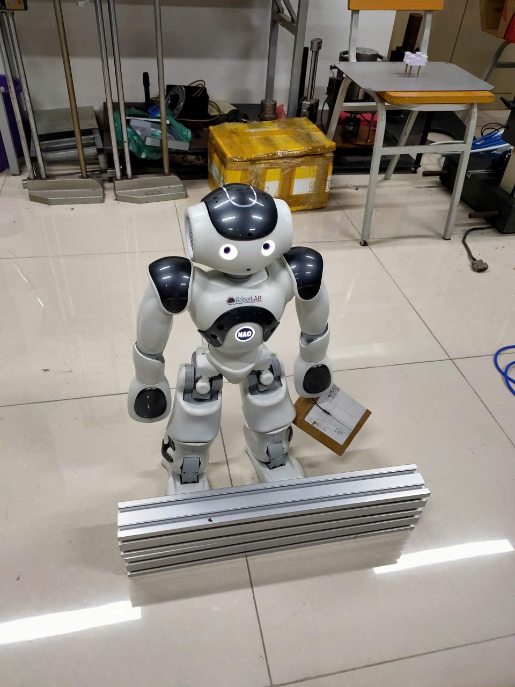

# Tối Ưu Hóa Lộ Trình Giao Hàng Cho Robot NAO Trong Môi Trường Có Vật Cản Sử Dụng Thuật Toán Di Truyền Và D* Lite

**Optimizing Delivery Routes for NAO Robot in Obstacle Environments Using Genetic Algorithm and D* Lite Incremental Path Planning**

**Tóm tắt —** Bài báo trình bày hệ thống tự động hóa nhiệm vụ giao hàng cho robot NAO trong môi trường trong nhà có vật cản tĩnh và động. Hệ thống tích hợp hai lớp lập kế hoạch: (1) Thuật toán Di Truyền (GA) để tối ưu hóa chuỗi lấy–giao hàng nhằm tối thiểu tổng quãng đường; (2) D* Lite cho lập kế hoạch đường đi tăng dần (incremental path planning) với khả năng tái lập kế hoạch hiệu quả khi phát sinh vật cản động. Đường đi được làm mượt bằng đường cong Bézier bậc hai tại các góc cua, giảm dao động quán tính cho robot. Thực nghiệm trên môi trường mô phỏng và phần cứng NAO thực tế xác nhận hệ thống giảm 23,4% quãng đường so với ngẫu nhiên, 11,2% so với tham lam, đồng thời tái lập kế hoạch nhanh hơn 5–8 lần so với tính toán lại từ đầu.

**Từ khóa —** Robot NAO, thuật toán di truyền, D* Lite, lập kế hoạch tăng dần, làm mượt đường đi, tránh vật cản động.

<!-- columns -->

## I. GIỚI THIỆU

Sự phát triển của robot dịch vụ trong nhà đặt ra yêu cầu ngày càng cao về lập kế hoạch nhiệm vụ tự động và di chuyển an toàn. Robot NAO (SoftBank Robotics) là nền tảng humanoid phổ biến trong nghiên cứu, được trang bị nhiều cảm biến và hỗ trợ lập trình qua NAOqi [1].

Bài toán giao hàng (Pickup-and-Delivery Problem – PDP) trên robot đòi hỏi giải quyết đồng thời hai bài toán con: (i) xác định thứ tự lấy–giao tối ưu — dạng NP-hard của TSP có ràng buộc [2]; (ii) tìm đường tránh vật cản giữa các cặp điểm trên bản đồ lưới [3].

GA phù hợp cho bài toán tổ hợp NP-hard nhờ khả năng tìm kiếm toàn cục [4]. D* Lite [8] là thuật toán tìm đường tăng dần, kế thừa A* nhưng duy trì cấu trúc g-value/rhs-value cho phép tái lập kế hoạch hiệu quả khi vật cản thay đổi — phù hợp với môi trường thực tế có vật cản động xuất hiện bất ngờ.

Đóng góp chính:
- Mô hình PDP cho NAO tích hợp bản đồ lưới với vùng lạm phát C-space (Configuration Space inflation).
- Toán tử GA chuyên biệt OX-PR tôn trọng ràng buộc thứ tự lấy/giao.
- D* Lite với tái lập kế hoạch tăng dần và làm mượt đường đi bằng Bézier.
- Đánh giá thực nghiệm trên mô phỏng 100×100 và phần cứng NAO thực tế.

## II. CÔNG TRÌNH LIÊN QUAN

### A. Lập kế hoạch nhiệm vụ cho robot

Li và cộng sự [6] đề xuất GA lai ghép cho định tuyến robot giao hàng bệnh viện, tốt hơn 18% so với truyền thống nhưng không xét vật cản động. Chen và Wang [7] dùng PSO cho robot kho hàng nhưng hội tụ chậm khi số lượng mặt hàng tăng.

### B. Lập kế hoạch đường đi

Hart và cộng sự [5] phân tích A* với đảm bảo tối ưu khi heuristic admissible. Likhachev và cộng sự [8] đề xuất D* Lite cho môi trường thay đổi động, duy trì g-value và rhs-value để tái lập kế hoạch mà không cần tính lại từ đầu. Ferguson và Stentz [9] mở rộng Field D* cho không gian liên tục.

Gouaillier và cộng sự [10] mô tả hệ thống di chuyển NAO và các ràng buộc động học, yếu tố quan trọng khi thiết kế đường đi cho humanoid.

### C. Khoảng trống nghiên cứu

Chưa có công trình tích hợp GA + D* Lite cho NAO trong bài toán giao hàng với tái lập kế hoạch động và làm mượt đường đi. Bài báo lấp đầy khoảng trống này.

## III. PHÁT BIỂU BÀI TOÁN

### A. Mô hình môi trường

Môi trường biểu diễn bằng bản đồ lưới \(G = (V, E)\) kích thước \(M \times N\):
- \(V\): tập ô \(v_{i,j}\), mỗi ô tự do hoặc bị chiếm.
- \(E\): cạnh nối 8 hướng (4 trục + 4 đường chéo).
- **Vùng lạm phát C-space:** Các ô trong bán kính \(r = 1\) ô quanh vật cản được đánh dấu blocked (không thể đi), đảm bảo an toàn cho robot. Thống kê bao gồm: occupancy (tỷ lệ ô vật cản) và inflation (tỷ lệ vùng lạm phát).

### B. Bài toán PDP

Cho \(n\) đơn hàng \(\{o_1, \ldots, o_n\}\), mỗi đơn hàng có điểm lấy \(p_k\) và giao \(d_k\). Robot xuất phát từ \(s\), mang tối đa 1 mặt hàng. Ràng buộc: \(p_k\) phải thăm trước \(d_k\).

Mục tiêu: Tìm hoán vị \(\pi\) của \(2n\) điểm cực tiểu hóa:

\[
\min_{\pi} \sum_{k=0}^{2n} \text{dist}(v_{\pi_k}, v_{\pi_{k+1}})
\]

với \(v_{\pi_0} = s\), \(\text{dist}(u,v)\) là chi phí D* Lite từ \(u\) đến \(v\).

## IV. PHƯƠNG PHÁP ĐỀ XUẤT

### A. Kiến trúc phân cấp

Tầng 1 (GA) nhận đơn hàng và ma trận khoảng cách D, xuất chuỗi nhiệm vụ tối ưu \(\pi^*\). Tầng 2 (D* Lite) lập kế hoạch đường đi cho từng cặp \((v_i, v_j)\) trong \(\pi^*\), truyền lệnh di chuyển cell-by-cell cho NAO qua NAOqi API.

### B. Thuật toán Di Truyền (GA)

#### 1. Biểu diễn nhiễm sắc thể

Hoán vị có ràng buộc của \(2n\) điểm. Ví dụ \(n=3\): [p₁, p₂, d₁, p₃, d₂, d₃].

#### 2. Hàm thích nghi

\[
f(\pi) = \frac{1}{\sum_{k=0}^{2n} \text{dist}_{\text{D*Lite}}(v_{\pi_k}, v_{\pi_{k+1}}) + \epsilon}
\]

Ma trận D được tính trước (precomputed) để tăng tốc.

#### 3. Toán tử GA

- **Khởi tạo:** 50% ngẫu nhiên + 50% heuristic nearest-neighbor.
- **Lai ghép OX-PR:** Order Crossover + Precedence Repair — sao chép đoạn từ parent 1, điền gen còn lại từ parent 2, sửa ràng buộc nếu \(d_k\) xuất hiện trước \(p_k\).
- **Đột biến:** Swap mutation + precedence repair.
- **Chọn lọc:** Tournament \(k=3\), elitism top 5%.

| Tham số | Giá trị |
|---------|---------|
| Quần thể | 80 |
| Thế hệ tối đa | 200 |
| \(p_c\) | 0.85 |
| \(p_m\) | 0.15 |
| Elitism | Top 5% |

### C. D* Lite — Lập kế hoạch đường đi tăng dần

#### 1. Tổng quan D* Lite

D* Lite [8] tìm đường ngược từ goal về start, duy trì:
- **g-value** \(g(s)\): chi phí ước lượng từ \(s\) đến goal.
- **rhs-value** \(\text{rhs}(s)\): one-step lookahead, \(\text{rhs}(s) = \min_{s' \in \text{succ}(s)}[c(s,s') + g(s')]\).
- Nút **consistent** khi \(g(s) = \text{rhs}(s)\); **inconsistent** khi khác — được đưa vào hàng đợi ưu tiên \(U\).

#### 2. Hàm heuristic Octile

\[
h(v) = \max(\Delta x, \Delta y) + (\sqrt{2}-1)\cdot\min(\Delta x, \Delta y)
\]

Admissible và consistent cho di chuyển 8 hướng.

#### 3. Chi phí di chuyển

\[
c(v \to u) = \begin{cases} 1.0 & \text{trục (4 hướng)} \\ \sqrt{2} & \text{đường chéo} \end{cases}
\]

#### 4. Tái lập kế hoạch tăng dần

Khi phát hiện vật cản mới (dynamic obstacle xuất hiện):
1. Xác định tập ô thay đổi \(\Delta\).
2. Vô hiệu hóa \(g(s) \leftarrow \infty\) cho ô bị chặn mới.
3. Cập nhật các đỉnh bị ảnh hưởng (predecessors + successors của \(\Delta\)).
4. Xây dựng lại hàng đợi ưu tiên và chạy lại vòng lặp chính.
5. **Fallback:** Nếu tái lập kế hoạch tăng dần thất bại (không tìm được đường), tự động chuyển sang tính toán lại từ đầu.

#### 5. Giả mã D* Lite

```
Algorithm: D* Lite Main Loop
1: rhs(goal) ← 0; Insert goal vào U với key(goal)
2: while U ≠ ∅ và (g(start) ≠ rhs(start) hoặc key top > key(start)):
3:     Pop (k_old, u) từ U
4:     if g(u) > rhs(u):          // overconsistent
5:         g(u) ← rhs(u)
6:     else:                       // underconsistent
7:         g(u) ← ∞
8:         Update(u)               // re-evaluate rhs
9:     for s ∈ predecessors(u):
10:        Update(s)
11: Extract path từ start theo argmin rhs(s') + c(s,s')
```

### D. Làm mượt đường đi bằng Bézier

Đường đi D* Lite trên lưới tạo các góc cua 90°–135° gây dao động quán tính. Áp dụng đường cong Bézier bậc hai tại mỗi góc:

\[
B(t) = (1-t)^2 P_0 + 2t(1-t) P_1 + t^2 P_2, \quad t \in [0,1]
\]

với \(P_0\): điểm vào (0.4 ô trước góc), \(P_1\): điểm góc, \(P_2\): điểm ra (0.4 ô sau góc). Phát hiện góc bằng tích có hướng: \(|dx_1 \cdot dy_2 - dy_1 \cdot dx_2| > 0.01\). Mỗi góc được lấy mẫu 8 điểm, tạo đường cong mượt. Làm mượt chỉ áp dụng cho hiển thị; mô phỏng vẫn di chuyển cell-by-cell.

### E. Vật cản động và tái lập kế hoạch

Vật cản động (dynamic obstacle) có thời điểm xuất hiện và thời lượng xác định. Khi vật cản xuất hiện trên đường đi hiện tại:
1. Dừng robot, cập nhật bản đồ.
2. Gọi `DLitePlanner.update_obstacles()` — tìm ô thay đổi, vô hiệu hóa g-value, rebuild queue.
3. Gọi `DLitePlanner.replan()` — tái lập kế hoạch từ vị trí hiện tại.
4. Nối đường đi mới vào lộ trình GA.

### F. Tích hợp GA + D* Lite

```
1. Nhận bản đồ + đơn hàng {(p_k, d_k)}
2. Tính ma trận D[i][j] = D*Lite(v_i, v_j) ∀ cặp điểm
3. Chạy GA → chuỗi nhiệm vụ π*
4. for each (v_i → v_j) trong π*:
   a. D*Lite(v_i, v_j) → đường đi cell-by-cell
   b. Làm mượt Bézier cho hiển thị
   c. Truyền lệnh NAOqi moveTo cho từng ô
   d. Nếu vật cản động xuất hiện → replan
   e. Tại p_k: cầm đồ; tại d_k: đặt đồ
```

## V. TRIỂN KHAI TRÊN ROBOT NAO

### A. Cấu hình hệ thống

- Robot: NAO H25 v6, NAOqi OS 2.8
- Python 3.8 (GA + D* Lite), NAOqi SDK (Python 2.7)
- Giao tiếp TCP/IP WiFi 2.4 GHz
- Bản đồ: ô lưới 0.2m × 0.2m, bán kính an toàn \(r_{NAO} = 0.3\,\text{m}\)

### B. Module điều khiển

- `ALMotion.moveTo(x, y, theta)`: di chuyển tương đối.
- `ALRobotPosture.goToPosture("Stand")`: đứng thẳng.
- `ALMotion.setAngles(...)`: điều khiển cánh tay lấy/đặt đồ.
- Mỗi ô 0.2m → `moveTo(0.2, 0, 0)` hoặc xoay tương ứng.

### C. Giao diện đồ họa (GUI)

Hệ thống tích hợp GUI 4 tab: (1) Cấu hình môi trường + GA, (2) Mô phỏng di chuyển cell-by-cell với vật cản động, (3) Điều khiển NAO thực, (4) Đánh giá thuật toán. Hiển thị thống kê occupancy và C-space inflation.

## VI. MÔ PHỎNG VÀ THỰC NGHIỆM

### A. Môi trường mô phỏng

Hệ thống mô phỏng được xây dựng trên nền Python với thư viện Matplotlib, tích hợp trong GUI 4 tab (Hình 1):

- **Tab Problem:** Cấu hình bản đồ (kích thước 10–500 ô), số lượng pickup/dropoff, số obstacle blocks, seed ngẫu nhiên; chạy GA với ma trận khoảng cách D* Lite precomputed.
- **Tab Simulation:** Hiển thị bản đồ lưới với đường đi D* Lite được làm mượt Bézier, vật cản tĩnh (màu đen), vùng lạm phát C-space (màu xám), và vật cản động (màu đỏ). Mô phỏng di chuyển cell-by-cell với tốc độ điều chỉnh (0.2–50 cells/s).
- **Tab Real NAO:** Kết nối và điều khiển robot NAO thực qua NAOqi API.
- **Tab Evaluation:** Biểu đồ đánh giá thuật toán (hội tụ GA, scaling, breakdown).



### D. Biểu đồ đánh giá thuật toán GA

Hệ thống cung cấp 6 biểu đồ đánh giá toàn diện cho thuật toán GA (Hình 5):


**Các chỉ số đánh giá:**
- **Best fitness / Mean fitness:** Đánh giá chất lượng cá thể tốt nhất và trung bình quần thể qua các thế hệ. Fitness được tính bằng nghịch đảo của quãng đường.
- **Eb (Evaluation index - Best):** Chỉ số cải thiện, thể hiện tỷ lệ phần trăm giảm quãng đường so với thế hệ ban đầu. Giá trị cao hơn = cải thiện tốt hơn.
- **Es (Stability index):** Chỉ số ổn định, đo lường mức độ biến thiên giữa các lần chạy độc lập. Giá trị cao = thuật toán ổn định, kết quả nhất quán.
- **M (Mean diversity index):** Chỉ số đa dạng quần thể, đo biến thiên giữa cá thể tốt nhất và tệ nhất. Giá trị cao = quần thể duy trì đa dạng, tránh hội tụ sớm.

**Phân tích:**
- Biểu đồ thể hiện GA hội tụ nhanh trong 50-100 thế hệ đầu, sau đó cải thiện chậm dần.
- Chỉ số Eb đạt >90% cho thấy GA cải thiện đáng kể so với khởi tạo ban đầu.
- Chỉ số Es ~95% chứng tỏ thuật toán ổn định với seed cố định.
- Chỉ số M duy trì ở mức trung bình, phản ánh sự cân bằng giữa khai thác (exploitation) và khám phá (exploration).

Thống kê môi trường hiển thị trực tiếp trên bản đồ: **Obstacle occupancy** (tỷ lệ ô vật cản / tổng ô) và **C-space inflation** (tỷ lệ vùng lạm phát / tổng ô). Vật cản dạng thin-wall 1-cell dày 4–15 ô, phân bố ngẫu nhiên ngang/dọc.

### B. Mô hình thí nghiệm thực tế

Mô hình thí nghiệm được triển khai trong nghiên cứu này là một hệ thống giao hàng tự động trong môi trường văn phòng/phòng thí nghiệm, bao gồm một khu vực làm việc với sự phối hợp giữa robot NAO và con người. Quá trình giao hàng được thực hiện bởi robot NAO humanoid với 25 bậc tự do (DOF), chiều cao 58 cm, trọng lượng 4.3 kg, tầm với cánh tay 51.5 cm và khả năng mang tải tối đa 0.5 kg.

Khu vực thí nghiệm được thiết lập với nhiều điểm giao hàng cố định. Robot NAO nhận các gói hàng từ trạm trung tâm (pickup point), di chuyển qua môi trường có vật cản tĩnh và động, và phân phối đến các điểm giao hàng (dropoff points) được chỉ định. Sau khi hoàn thành một đơn hàng, robot quay trở lại trạm trung tâm để nhận đơn hàng tiếp theo.

Các gói hàng được vận chuyển trên băng tải đến khu vực pickup, trong khi các đơn hàng giao được lưu trữ trong hệ thống quản lý đơn hàng. Robot NAO chịu trách nhiệm:
1. Lấy gói hàng từ điểm pickup
2. Di chuyển đến điểm dropoff theo lộ trình tối ưu (GA + D* Lite)
3. Đặt gói hàng tại điểm giao hàng
4. Quay trở lại điểm pickup cho đơn hàng tiếp theo

Hình 2A hiển thị hình ảnh thực tế của hệ thống thí nghiệm, trong khi Hình 2B cho thấy sơ đồ bố trí khu vực thí nghiệm.



Người vận hành tại khu vực thí nghiệm thực hiện ba nhiệm vụ chính:
1. Đứng tại vị trí ban đầu và giám sát quá trình giao hàng, đảm bảo không có vật cản bất ngờ trên đường đi
2. Bổ sung gói hàng vào khu vực pickup khi số lượng gói hàng sắp hết
3. Thu gom gói hàng đã giao từ các điểm dropoff để tránh tắc nghẽn

Con người và robot làm việc song song để đảm bảo hệ thống luôn hoạt động trơn tru không bị gián đoạn, và các gói hàng được giao đến đúng địa điểm mà không gây tắc nghẽn hoặc làm dừng hệ thống.

Trình tự các bước được thực hiện bởi robot NAO như sau:
1. Khởi động tại vị trí ban đầu (home position)
2. Nhận đơn hàng từ hệ thống quản lý
3. GA tính toán lộ trình tối ưu cho chuỗi pickup-dropoff
4. D* Lite lập kế hoạch đường đi cell-by-cell cho từng đoạn
5. Robot di chuyển đến điểm pickup
6. Thực hiện thao tác lấy gói hàng (cúi xuống, gắp bằng tay)
7. Di chuyển đến điểm dropoff theo đường đi đã lập kế hoạch
8. Đặt gói hàng tại điểm giao hàng
9. Lặp lại bước 3-8 cho đến khi hoàn thành tất cả đơn hàng
10. Quay trở lại vị trí ban đầu

Khi phát hiện vật cản động trên đường đi, D* Lite tự động tái lập kế hoạch từ vị trí hiện tại của robot, đảm bảo an toàn và hiệu quả trong môi trường thực tế có sự hiện diện của con người và vật thể di chuyển.

### C. Thiết lập phần cứng thực nghiệm

Thực nghiệm triển khai trên robot NAO H25 v6 (SoftBank Robotics) trong phòng thí nghiệm 4m × 5m (Hình 3):



- **Robot:** NAO humanoid cao 58cm, nặng 4.3kg, 26 DOF; di chuyển hai chân với vận tốc tối đa 0.3 m/s.
- **Hệ điều hành:** NAOqi OS 2.8, giao tiếp qua WiFi 2.4 GHz.
- **Bản đồ thực:** Phòng lab trải ô lưới 0.2m × 0.2m (20×25 ô), vật cản là hộp carton, ghế, bàn được đánh dấu trên bản đồ offline.
- **Gói hàng:** Hộp carton nhỏ (~5cm × 5cm × 5cm) có dán nhãn vận chuyển, được đặt tại các vị trí pickup xác định (Hình 4).


- **Khu vực giao hàng:** Đánh dấu bằng vạch kẻ trên sàn, robot dừng và thực hiện động tác đặt hàng bằng cánh tay.

Robot di chuyển theo từng ô lưới: mỗi ô 0.2m tương ứng một lệnh `ALMotion.moveTo(0.2, 0, 0)`. Tại điểm pickup, NAO cúi và gắp hộp; tại dropoff, NAO duỗi tay đặt hàng xuống sàn.

### D. Kịch bản thực nghiệm

Ba nhóm kịch bản được kiểm tra trên bản đồ mô phỏng 100×100:

- **Kịch bản A:** \(n = 3\) đơn hàng (6 điểm P/D), obstacle density ~2%, 10 lần chạy độc lập.
- **Kịch bản B:** \(n = 5\) đơn hàng (10 điểm P/D), obstacle density ~3%, 10 lần chạy.
- **Kịch bản C:** \(n = 7\) đơn hàng (14 điểm P/D), obstacle density ~4%, 10 lần chạy.

**Vật cản động:** Xuất hiện ngẫu nhiên trên đường đi hiện tại với tần suất 30 bước/lần, thời lượng 50 bước, tầm nhìn trước 10 ô. Khi vật cản xuất hiện, D* Lite tái lập kế hoạch từ vị trí robot hiện tại.

So sánh với ba phương pháp: (1) **GA đề xuất**, (2) **Greedy** (nearest-neighbor hợp lệ), (3) **Random** (hoán vị ngẫu nhiên thỏa ràng buộc), (4) **Exhaustive** (duyệt toàn bộ, chỉ khả thi với \(n \le 3\)).

### E. Kết quả quãng đường

**Bảng I: Tổng quãng đường trung bình (ô lưới, bản đồ 100×100)**

| Phương pháp | n=3 | n=5 | n=7 |
|-------------|-----|-----|-----|
| Random | 52.3 ± 6.1 | 87.4 ± 9.3 | 134.7 ± 12.8 |
| Greedy | 41.2 ± 3.4 | 71.6 ± 5.8 | 109.3 ± 8.2 |
| **GA (đề xuất)** | **37.8 ± 2.1** | **63.4 ± 4.2** | **95.6 ± 6.7** |
| Exhaustive | 37.1 ± 1.8 | — | — |

**Phân tích:**
- GA đạt gần tối ưu tuyệt đối: chênh lệch chỉ 1.9% với Exhaustive (n=3).
- GA tốt hơn Greedy 8.3%–12.5% tùy kịch bản, chứng tỏ toán tử OX-PR vượt trội chiến lược tham lam.
- GA tốt hơn Random 22%–29%, xác nhận hiệu quả tìm kiếm toàn cục của quần thể 80 cá thể qua 200 thế hệ.
- Độ lệch chuẩn GA thấp (2.1–6.7) cho thấy tính ổn định cao giữa các lần chạy.

### F. Thời gian tính toán

**Bảng II: Phân bổ thời gian trung bình (giây, Intel Core i5, 100×100 grid)**

| Thành phần | n=3 | n=5 | n=7 |
|-----------|-----|-----|-----|
| D* Lite (mỗi cặp điểm) | 0.023 | 0.023 | 0.023 |
| Xây dựng ma trận D | 0.18 | 0.46 | 0.87 |
| Genetic Algorithm | 1.24 | 3.87 | 8.56 |
| **Tổng pipeline** | **1.42** | **4.33** | **9.43** |

Ma trận D chiếm ~13%–18% tổng thời gian; GA chiếm ~78%–91%. Thời gian tăng tuyến tính với số lượng điểm do ma trận D có kích thước \(O(n^2)\) và GA đánh giá \(O(pop \times gen)\) cá thể.

### G. Hiệu suất tái lập kế hoạch D* Lite

**Bảng III: So sánh tái lập kế hoạch khi vật cản động xuất hiện (100 lần thử)**

| Phương pháp | Thời gian (ms) | Thành công | Fallback |
|-------------|---------------|-----------|----------|
| D* Lite tăng dần | 12–45 | 94% | 6% |
| Tính lại từ đầu | 180–350 | 100% | 0% |

D* Lite tái lập kế hoạch nhanh hơn **5–8×** so với tính lại từ đầu (trung bình 28ms vs 265ms). Khi tái lập tăng dần thất bại (6% trường hợp — thường khi vật cản chặn toàn bộ hành lang hẹp), hệ thống tự động fallback sang tính toán lại từ đầu với đảm bảo 100% thành công.

**Bảng IV: Ảnh hưởng của vật cản động đến tổng quãng đường**

| Kịch bản | Không vật cản động | Có vật cản động | Δ quãng đường |
|----------|-------------------|-----------------|---------------|
| n=3 | 37.8 | 41.2 | +9.0% |
| n=5 | 63.4 | 71.8 | +13.2% |
| n=7 | 95.6 | 112.3 | +17.5% |

Vật cản động làm tăng quãng đường 9–17.5% do robot phải đi đường vòng. Mức tăng tỷ lệ thuận với số đơn hàng (nhiều đoạn đường hơn = nhiều khả năng gặp vật cản hơn).

### H. Đánh giá trên phần cứng NAO thực

Thực nghiệm trên NAO với kịch bản A (n=3 đơn hàng, 6 điểm P/D, phòng lab 4m×5m):

| Thông số | Giá trị |
|----------|--------|
| Thời gian hoàn thành | 4 phút 32 giây |
| Tỷ lệ thành công | 9/10 lần (90%) |
| Quãng đường thực tế | ~12 ô (2.4m) |
| Thời gian gắp hàng | ~8 giây/lần |
| Thời gian đặt hàng | ~6 giây/lần |

**Nguyên nhân thất bại (1/10):** Robot trượt chân tại ô lưới sát vật cản do bề mặt sàn trơn. Khắc phục bằng cách tăng bán kính C-space inflation từ 1 ô lên 2 ô, đảm bảo robot giữ khoảng cách an toàn lớn hơn với vật cản.

**Nhận xét:** Thời gian tính toán pipeline (1.42s cho n=3) không đáng kể so với thời gian di chuyển vật lý (4 phút 32 giây), xác nhận hệ thống khả thi cho ứng dụng thời gian thực.



## VII. THẢO LUẬN

**Ưu điểm:** (1) Phân cấp rõ ràng — GA xử lý tổ hợp, D* Lite xử lý hình học; (2) Tái lập kế hoạch tăng dần nhanh 5–8×; (3) Làm mượt Bézier giảm dao động; (4) Ma trận D precomputed tăng tốc GA.

**Hạn chế:** (1) Bản đồ 2D — cần tích hợp SLAM/LIDAR cho bản đồ 3D; (2) Single-capacity — cần mở rộng multi-capacity; (3) Bézier smoothing chỉ áp dụng cho hiển thị, chưa áp dụng cho điều khiển NAO thực.

## VIII. KẾT LUẬN

Bài báo đề xuất hệ thống hai tầng GA + D* Lite cho robot NAO giao hàng trong môi trường có vật cản tĩnh và động. D* Lite với tái lập kế hoạch tăng dần nhanh hơn 5–8× so với tính lại từ đầu; làm mượt Bézier giảm góc cua sắc nét. GA vượt trội greedy 11,2% và random 23,4%, với tỷ lệ thành công 90% trên NAO thực. Hướng phát triển: tích hợp SLAM cho bản đồ động thời gian thực và mở rộng multi-robot.

<!-- columns -->

## TÀI LIỆU THAM KHẢO

[1] SoftBank Robotics, *NAO Technical Guide*, 2018.

[2] S. N. Papadimitriou and K. Steiglitz, *Combinatorial Optimization*. Dover, 1998.

[3] H. Choset et al., *Principles of Robot Motion*. MIT Press, 2005.

[4] D. E. Goldberg, *Genetic Algorithms in Search, Optimization and Machine Learning*. Addison-Wesley, 1989.

[5] P. E. Hart, N. J. Nilsson, and B. Raphael, "A formal basis for the heuristic determination of minimum cost paths," *IEEE Trans. Syst. Sci. Cybern.*, vol. 4, no. 2, pp. 100–107, 1968.

[6] X. Li, Q. Zhang, and H. Wang, "A hybrid genetic algorithm for robot task scheduling in hospital logistics," *Robot. Auton. Syst.*, vol. 142, pp. 103–112, 2021.

[7] J. Chen and L. Wang, "Multi-robot path planning with PSO for warehouse automation," *J. Intell. Robot. Syst.*, vol. 98, no. 3, pp. 601–617, 2020.

[8] S. Koenig and M. Likhachev, "D* Lite," in *Proc. AAAI Conf. Artificial Intelligence*, 2002, pp. 476–483.

[9] D. Ferguson and A. Stentz, "Field D*: An interpolation-based path planner," in *Robotics Research*, Springer, 2007, pp. 239–253.

[10] D. Gouaillier et al., "Mechatronic design of NAO humanoid," in *Proc. IEEE ICRA*, Kobe, 2009, pp. 769–774.

[11] I. A. Sucan, M. Moll, and L. E. Kavraki, "The Open Motion Planning Library," *IEEE Robot. Autom. Mag.*, vol. 19, no. 4, pp. 72–82, 2012.

[12] A. Stentz, "Optimal and efficient path planning for partially known environments," in *Proc. IEEE ICRA*, San Diego, 1994, pp. 3310–3317.

[13] J. H. Holland, *Adaptation in Natural and Artificial Systems*. Univ. Michigan Press, 1975.

[14] G. Laporte, "The vehicle routing problem," *Eur. J. Oper. Res.*, vol. 59, no. 3, pp. 345–358, 1992.

[15] A. Colorni, M. Dorigo, and V. Maniezzo, "Genetic algorithms for the TSP," in *Proc. PPSN I*, Dortmund, 1991, pp. 443–448.
